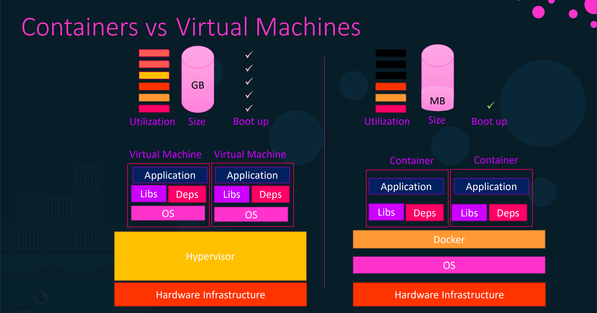

# Docker Essentials

## Why Docker?

1. **Matrix from Hell**  
   Managing library versions on an OS is complex.  
2. **Simplifying Environment Setup**  
   Setting up environments for new employees used to take hundreds of commands with specific configurations.  
3. **Cross-Platform Compatibility**  
   Running applications smoothly across various OS (Linux, Windows, etc.) was challenging.

---

## Key Concepts

### Docker Containers
- Docker containers run on the underlying OS.  
  - Example: On Linux, you can create containers for Ubuntu, Fedora, etc., but not for Windows.  
- Docker uses **LCX-type containers** and focuses on packaging applications, not OS virtualization.  

### Benefits of Docker against VM:
- Uses fewer resources (less space, faster boot time).  
- Lightweight, but with less isolation compared to VMs.

  

---

## Docker Commands

### General Commands
#### **View Docker Version**
```bash
docker version
```

#### **List All Docker Images**
```bash
docker images
```

#### **List Running Containers**
```bash
docker ps
```

#### **List All Containers (Including Stopped)**
```bash
docker ps -a
```

---

### Managing Containers
#### **Run a Container**
```bash
docker run {image_name}
```
> Pulls the image if not found locally.  

#### **Stop a Running Container**
```bash
docker stop {container_name}
```

#### **Remove a Stopped Container**
```bash
docker rm {container_name}
```

#### **Execute a Command in a Running Container**
```bash
docker exec {container_name} {command}
```

---

### Working with Images
#### **Pull an Image**
```bash
docker pull {image_name}
```

#### **Remove an Image**
```bash
docker rmi {image_name}
```
> Ensure no dependent containers exist.

---

## Advanced Docker Usage

### Port Mapping
#### **Map Container Ports to Host Ports**
```bash
docker run -p 5000:8080 springbootapp
```

### Data Persistence
#### **Use Volumes to Persist Data**
```bash
docker run -v /opt/datadir:/var/lib/mysql mysql
```

### Logging and Inspection
#### **View Logs of a Detached Container**
```bash
docker logs {container_name}
```

#### **Inspect Container Details**
```bash
docker inspect {container_name}
```

---

## Interactive Mode
#### **Run in Interactive + Terminal Mode**
```bash
docker run -it {image_name}
```

**Example:**
```bash
docker run -it simpleapp
```

---

## Updates on Jenkins Image

The Jenkins image `jenkins` is deprecated. Use `jenkins/jenkins` instead.  

### New Command:
```bash
docker run jenkins/jenkins
```

#### References:
- [Jenkins Blog](https://www.jenkins.io/blog/2018/12/10/the-official-Docker-image/)  
- [Docker Hub: Jenkins](https://hub.docker.com/r/jenkins/jenkins/)

---

